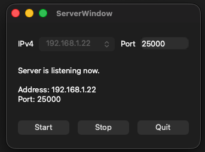
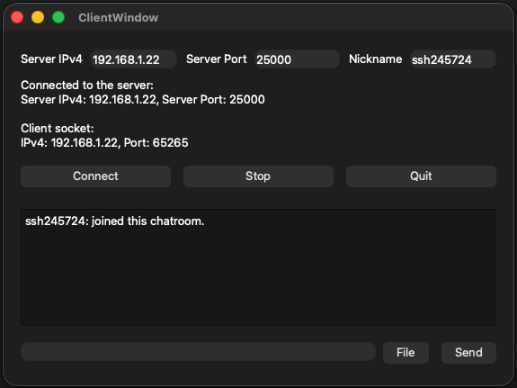

# Qt TCP Client-Server Chat Application

A robust C++ desktop chat system built with the Qt Framework. This project includes both a server and a client application, supporting real-time text messaging, file sharing, and connection monitoring via a custom binary TCP protocol.

<div align="center">
    
    
    <p><em>Server and Client GUI </em></p>
</div>

---

## Features

### Server Application
* **Graphical User Interface (GUI):** A clean interface (`ServerWindow`) that automatically detects available IPv4 addresses, allowing users to select an IP and input a port number easily.
* **Multi-Client Support:** Built on `QTcpServer` and `QTcpSocket`, it manages multiple concurrent client connections.
* **Message Broadcasting:** Automatically broadcasts any received text message to all other connected clients.
* **Heartbeat Mechanism:** Monitors connection health by sending a heartbeat ping every 10 seconds. If a client fails to respond for 30 seconds (3 cycles), the server disconnects the socket to prevent stale connections.

### Client Application
* **Real-time Messaging:** Send and receive text messages instantly.
* **File Transfer with Confirmation:** Attach files to your chat with a confirmation dialog (`FileSenderDialog`) to prevent accidental transfers.
* **Nickname System:** Set a custom nickname (up to 16 characters) for identification in the chatroom.
* **Interactive Message Log:** Formatted `QTextBrowser` with support for clickable file links and system status updates.
* **Status Monitoring:** Real-time logging of socket states and connection errors.

---

## Tech Stack
* **Language:** C++17 or higher
* **Framework:** Qt (Core, Gui, Widgets, Network)
* **Build System:** CMake / qmake

---

## Project Structure
* `main.cpp`: Application entry point.
* **Server Components**: 
    * `server.h/cpp`: Core server logic.
    * `serverwindow.h/cpp/ui`: Main server window.
    * `clientsocket.h/cpp`: Individual client connection handler.
* **Client Components**: 
    * `clientwindow.h/cpp/ui`: Main client window and logic.
    * `filesenderdialog.h/cpp/ui`: File upload confirmation modal.
* **Shared Components**: 
    * `packetHeader.h`: Unified communication protocol definition.

---

## Network Protocol
The application uses a custom binary header (`PacketHeader`) to ensure structured and reliable data exchange.

```cpp
enum class ePacketType : quint8 {
    Heartbeat = 0,
    TextMessage,
    File
};

typedef struct PacketHeader {
    ePacketType packetType;               // Type of packet (Heartbeat, Text, or File)
    quint32 packetSize;                   // Size of the payload following the header
    char senderNickName[17];              // Null-terminated sender name (Max 16 chars)
    char fileName[33];                    // Null-terminated file name (Max 32 chars)
} PacketHeader_t;
```

How to Run
1. Build: Open the project in Qt Creator and build using the appropriate kit.
2. Start Server:
    * Select the desired IPv4 address from the dropdown menu.
    * Enter a Port number (e.g., 8080).
    * Click Start to begin listening for connections.
3. Start Client:
    * Configure your Nickname.
    * Enter the Server's IP Address and Port.
    * Click Connect to join the chat.
4. Stop: Click Stop on the server to disconnect all clients and shut down.
